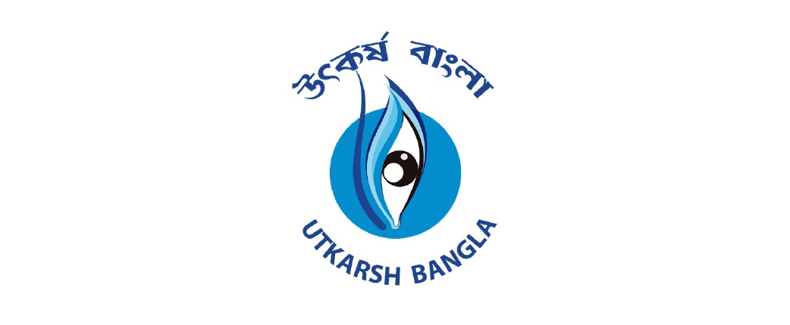

<p align="center">
  
</p>

# 🐍 PBSSD Python Programming Journey

Welcome to my learning repository! This project documents my progress in the **Paschim Banga Society for Skill Development (PBSSD)** Python Programming course. Here, I store my daily notes, practice scripts, and logic-building exercises.

---

## 🗓️ Day 01: The Foundations of Python
**Date:** December 18, 2025  
**Focus:** Development Environments, Dynamic Typing, and Memory Management.

### 1. Understanding the Environment
* **IDLE:** Explored the Interactive Shell for quick testing and Script Mode for permanent programs.
* **PVM (Python Virtual Machine):** Learned how the internal engine executes our source code.

### 2. Key Technical Concepts
* **Dynamic Typing:** Verified classes (`int`, `str`, `float`, `list`) using the `type()` function.
* **Memory Management:** Used `id()` to fetch unique memory addresses of objects.
* **Keywords:** Utilized the `keyword` module to identify reserved words.

---

## 🗓️ Day 02: Identifiers, Variables, and Memory
**Date:** December 19, 2025  
**Focus:** Naming conventions, ASCII values, and memory optimization.

### 1. Python Identifiers
* **Case Sensitivity:** Learned how Python differentiates names based on **ASCII** values.
* **Naming Rules:** Mastered rules for valid identifiers (no leading digits, no special symbols except `_`).
* **Built-in Functions:** Used `ord()` for character-to-ASCII and `chr()` for ASCII-to-character conversion.

---

## 🗓️ Day 03: Variable Scope & Memory Stack
**Date:** December 20, 2025  
**Focus:** Local vs. Global variables and LIFO memory logic.

### 1. Scope and Accessibility
* **Local Variables:** Declared inside blocks/functions; restricted visibility to that local area.
* **Global Variables:** Declared at the top level; accessible throughout the script.
* **The `global` Keyword:** Learned to modify global values from within a local scope.

### 2. Memory Logic (LIFO)
* **Stack Memory:** Explored how Python manages function calls using the **Last-In, First-Out** principle.

### 3. Homework & Problem Solving
* **Solved 12 logic-based questions** regarding variable scope and memory output.
* Solutions are available in the [Day_03 Folder](./Day_03).
---

## 🚀 Day 03: Practical Assignment Showcase
**Total Tasks:** 12 Python Scripts  
**Objective:** Mastering arithmetic operators, user input handling, and mathematical logic using "Pure Python" (No external modules).

### 🛠️ Problem-Solving Highlights
Below is the list of 12 logic-based programs I developed and pushed to the `Day_03/` folder:

| No. | Problem Statement | Core Logic / Formula |
| :--- | :--- | :--- |
| 01 | **Area of Parallelogram** | `base * height` |
| 02 | **Area of Conical Vessel** | $A = \pi r (l + r)$ (using $l = \sqrt{r^2 + h^2}$) |
| 03 | **Area of Parallelepiped** | $2 \times (ab + bh + ha)$ |
| 04 | **Quadratic Equation** | Used discriminant $d = b^2 - 4ac$ and roots formula |
| 05 | **Equilateral Triangle** | $Area = \frac{h^2}{\sqrt{3}}$ |
| 06 | **Area of Ellipse** | $\pi \times a \times b$ |
| 07 | **KM to Miles** | $km \times 0.6214$ |
| 08 | **Right-Angle Check** | Pythagorean Theorem: $a^2 + b^2 == c^2$ (Boolean logic) |
| 09 | **Temp Converter** | $C \rightarrow F$ and $C \rightarrow K$ |
| 10 | **Rhombus & Half-Circle** | $\frac{d_1 \times d_2}{4}$ and $\frac{\pi r^2}{2}$ |
| 11 | **Surface Area of Cube** | $6 \times s^2$ |
| 12 | **Precision Heron's** | Unit conversion: $cm \rightarrow m$ and $\mu m \rightarrow m$ |

### 🔍 Technical Observation
During this assignment, I practiced **Precision Unit Conversion**. In Task 12, I manually converted $2.3 \text{ cm}$ and $6.31 \text{ }\mu\text{m}$ to meters to ensure the dimensions were standardized before applying Heron's Formula.

---

## 🗓️ Day 04: Literals & Number Systems
**Date:** December 21, 2025  
**Focus:** Data types (Literals) and Base-N number representations.

### 1. Python Literals
Literals are constant values assigned to variables. I practiced identifying various types:
* **Numeric:** `int` (19), `float` (45.7), `complex` (10+20j).
* **Boolean:** `True` / `False`.
* **Collections:** `list` [ ], `tuple` ( ), `set` { }, and `dict` {key:value}.

### 2. Integral Representations (Number Systems)
Python allows representing integers in four different bases:

| System | Base (Radix) | Prefix | Digits |
| :--- | :--- | :--- | :--- |
| **Decimal** | 10 | None | 0-9 |
| **Binary** | 2 | `0b` or `0B` | 0, 1 |
| **Octal** | 8 | `0o` or `0O` | 0-7 |
| **Hexadecimal**| 16 | `0x` or `0X` | 0-9, A-F |

### 3. Conversion Functions
* **`bin()`**: Converts an integer to its binary string representation.
* **`oct()`**: Converts an integer to its octal string representation.
* **`hex()`**: Converts an integer to its hexadecimal string representation.
  ---

---
## 🗓️ Day 05: Strings, Hex, and Floating-Point Precision
**Date:** December 26, 2025  
**Focus:** Hexadecimal representations, String delimiters, and Manual Base Conversions.

### 1. Key Concepts
* **Hexadecimal:** Base-16 system using `0-9` and `A-F`. Prefixed with `0x`.
* **String Literals:** Mastered `' '`, `" "`, and `''' '''` for multi-line flexibility.
* **Exponential Notation:** Using `e/E` (Mantissa/Exponent) for fractional literals.
* **Triple Quotes (`'''`):** Used for multi-line strings and handling complex character nesting.
* **f-Strings (Formatted Literals):** Implemented `f"Text {variable}"` for dynamic and readable output.
* **The `.split()` Method:** Practiced splitting user input using custom delimiters.
* **Type Casting:** * `float(ord('a'))`: Converting ASCII integers to floating-point numbers.
    * `int(float_value)`: Handling conversions between decimal and whole numbers.
* **Base Functions:** Verification of manual Hex/Octal math using built-in `hex()` and `oct()`.
---
## 🗓️ Day 06: Complex Literals & Bitwise Foundations
**Date:** December 27, 2025  
**Focus:** Complex number manipulation, Type casting limitations, and Bitwise logic preparation.

### 1. Complex Literals & Components
* **Structure:** `x = real + imag j`
* **Observation:** The components `.real` and `.imag` always return **float** values.
* **Math Operations:** Successfully implemented addition, subtraction, multiplication, and division on complex objects.
* **Casting Rules:** * `complex -> str`: ✅ Possible.
    * `complex -> int/float`: ❌ Raises `TypeError`.
---
## 🗓️ Day 07: Type Casting (Widening & Narrowing)
**Focus:** Implicit vs. Explicit conversion and Collection Casting.

### 1. Casting Types
* **Implicit (Up-casting):** Small type to Large type (e.g., `int` -> `float`). Handled by PVM. No data loss.
* **Explicit (Down-casting):** User-defined conversion using functions. Potential for data loss.

### 2. Collection Conversions
* **`set()`:** Useful for removing duplicates from a `list` or `string`.
* **`dict()`:** Requires specific structures (Key-Value pairs). Cannot cast single numeric literals to a dictionary.

> **Note:** Today's session was highly motivational, focusing on the "Immortal support" provided by our mentor to master these foundational logic steps.
---
## 🗓️ Day 08: Logic & Computer Arithmetic
**Focus:** Explicit Casting, Number Compliments, and Decision Control.

### 1. Radix Compliments ($r$'s and $r-1$'s)
* Explored 2's, 7's, and 8's compliments for digital representation.
* These are essential for understanding how the CPU handles negative numbers and subtraction.

### 2. Explicit Type Casting (Narrowing)
* **Definition:** Storing a larger data type into a smaller one manually.
* **Risk:** Data loss (e.g., `15.7` becomes `15`).
* **Responsibility:** Manually handled by the developer.

### 3. Control Flow (Decision Making)
* Introduced the `if` statement to control the **Runtime Environment**.
* **Indentation:** Learned that Python uses indentation to define the "body" of a block.
---
## 🗓️ Day 09: Decision Making - if, else, and elif
**Topic:** Branching Logic and Nested Conditionals.

### 1. Theory of Choice
* **if-else:** Used for "Either/Or" decisions (Binary choices).
* **if-elif-else:** Used for sequential condition checking (Multiple exclusive paths).
* **Nesting:** Placing an `if` inside another `if` to handle multi-layered logic (e.g., checking if a number is positive AND even).


### 2. Practical Projects
* **Advanced Calculator:** Handles `+`, `-`, `*`, `/`, `%` with error handling for zero-division.
* **Character Classifier:** Uses string comparison logic to detect Uppercase, Lowercase, and Numeric digits.
* **Tiered Billing System:** A complex script calculating electricity costs based on usage units, utilizing nested ranges for precision.

### 💡 Engineering Insight
In the Electricity Bill problem, I learned that the **order of conditions** matters significantly in an `if-elif` ladder. Python stops at the first `True` condition it finds, so precision in range-setting is vital.

---
## 🗓️ Day 10: Iterative Statements (The while Loop)
**Topic:** Automating repetitive tasks using conditional loops.

### 1. Theory of Iteration
* **Definition:** Iterative statements are used to execute a block of code repeatedly.
* **The `while` Loop:** Best used when the number of iterations is **not known in advance**. The loop runs as long as the argument/parameter remains `True`.

## 🗓️ Day 12: Armstrong Numbers & For-Loop Iterators
**Topic:** Digit logic, Indexing, and Range-based iteration.

### (*_*) What is an Armstrong Number?
A number is an **Armstrong number** if the sum of its own digits each raised to the power of the number of digits equals the number itself. 
*Example:* $153$ ($3$ digits): $1^3 + 5^3 + 3^3 = 1 + 125 + 27 = 153$.


### (*_*) Iteration: The `for` Loop
* **Purpose:** Used when the number of executions is known in advance.
* **Stream Processing:** Python treats sequences (strings, lists, ranges) as streams of data starting at **index 0**.

### (*_*) The `range()` Function
* `range(n)`: Starts at 0, ends at n-1.
* `range(m, n)`: Starts at m, ends at n-1.
* `range(m, n, -1)`: Reverse iteration.

### (*_*) Sneak Peek: Functions (`def`)
* Introduced the concept of **Reusability**. Using `return` to pass values back from a logic block.

### 2. Logic Implementation
* **Factorial Calculation:** Using a decrementing `while` loop to multiply a sequence of numbers down to 1.
* **Range Analysis:** A sophisticated script that:
    1. Iterates through a user-defined range.
    2. Uses modulo logic to categorize numbers as Even or Odd.
    3. Maintains counters and running sums for both categories.

### 📝 B.Tech Student Note
In iterative logic, the **Update Statement** (like `temp -= 1` or `x += 1`) is the most important part. Without it, the loop becomes an "Infinite Loop," which can crash the runtime environment.
---
## 🗓️ Day 13: Nested Loops & Pattern Geometry
**Topic:** Coordinate-based iteration and range-bound algorithms.

### 1. Range Algorithms
* **Factorials in Range:** Calculating $n!$ for every integer in a user-defined interval.
* **Palindrome & Armstrong Ranges:** Implementing nested logic to filter numbers that satisfy specific symmetry or power-sum properties across large data sets.


### 2. Nested Loop Theory: The "Clock Hand" Model
* **Outer Loop:** Acts like the hour hand (moves once per full cycle of the inner loop).
* **Inner Loop:** Acts like the minute hand (completes all iterations for every single step of the outer loop).

### 3. Pattern Printing (Logic Matrix)
By treating the loop variables `i` (rows) and `j` (columns) as coordinates, I implemented the following geometric logic:
* **Left Triangle:** `if i >= j`
* **Right Triangle:** `if i + j >= r + 1`
* **Diagonal (X-Shape):** `if i == j or i + j == r + 1`
* **Hollow Square:** `if i == 1 or j == 1 or i == r or j == r`

### ✨ The "Curiosity" Zone
My favorite implementation today was combining boundary logic with mid-point logic `(i == (t+1)/2)` to create complex symmetrical grids.

### 2. Scientific & Exponential Complex Literals
Practiced defining complex numbers using scientific notation:
```python
x = -34e3 + (-45.6e3j) # Handling large-scale complex data

### 📝 Example Snippet: f-Strings
name = "Shubham Jana"
address = "Kolkata"
print(f"Name of the person is {name}")
print(f"Address of {name} is {address}")


## 📂 Repository Structure

PBSSD-PYTHON-LEARNING/
├── assets/
│   └── PBSSD.png              # Program Logo
├── Day_01/
│   └── day01_pbssd.py         # Foundations & IDLE
├── Day_02/
│   └── day02_pbssd.py         # Identifiers & ASCII
├── Day_03/
│   ├── day03_pbssd.py         # Scope & Memory Stack
│   └── Assignment_day03.py    # 12 Logic-based math scripts
├── Day_04/
│   └── day04_pbssd.py
├── Day_05/
│   ├── day05_pbssd.py         # Scope & Memory Stack
├── Day_06/
│   └── day06_pbssd.py
├── Day_07/
│   └── day07_pbssd.py
├── Day_08/
│   └── day08_pbssd.py
├── Day_09/
│   └── day09_pbssd.py
├── .gitignore                 # Files to exclude from Git
├── LICENSE                    # Project License
└── README.md                  # Project Documentation
